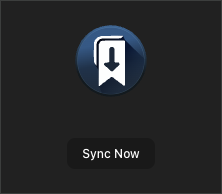

<h1>
  
  <span>Bookmark Sync for GitHub</span>
</h1>

> Synchronize browser bookmarks from a GitHub repository.

## 🚀 **Why Use This Extension?**

Have you ever wished to share a common set of bookmarks across a team or organization without needing everyone to manually update their bookmarks?

This extension allows for just that.

Store bookmarks in a simple JSON structure in your organization's GitHub repository, and let everyone have the latest bookmarks at their fingertips.

## 🚀 Features

- 🔄 **Automatic Synchronization**: Sync bookmarks every hour and shortly after the browser starts.
- ✋ **Manual Sync**: Need the latest bookmarks immediately? Trigger a sync manually.
- 🎯 **Selective Sync**: Syncs only the folders contained in the remote bookmark files without touching others you might have.
- 📁 **Multi-File Support**: Organize your organizations bookmarks into separate JSON files, for example by project.
- 📢 **Notifications**: Stay informed about successful syncs or if any issues arise.
- 🔒 **Secure**: Uses GitHub's Personal Access Token (PAT) for authentication, ensuring secure access.

## 🛠 Installation

[link-chrome]: https://chromewebstore.google.com/detail/bookmark-sync-for-github/fponkkcbgphbndjgodphgebonnfgikkl?hl=en&pli=1 'Version published on Chrome Web Store'
[link-firefox]: https://addons.mozilla.org/en-US/firefox/addon/bookmark-sync-for-github/ 'Version published on Mozilla Add-ons'

[][link-firefox] [][link-firefox]

[][link-chrome] [][link-chrome] also compatible with [Orion](https://kagi.com/orion/)

## 📖 Usage

1. **Install** the extension using the above steps.
2. **Configure** your GitHub Personal Access Token, the Git repository and the path to your bookmark JSON file(s).
3. The extension will **automatically synchronize** the bookmarks from the JSON file(s) into your bookmark bar.

## ⚙ Configuration

Access the extension's options and provide:

1. **GitHub Personal Access Token**: Ensure this token has access to the repository. _Your token is stored securely and used only for fetching the files. Use a fine-grained token restricted to the repository._
2. **Organization**: The account owner of the repository. The name is not case sensitive.
3. **Repository**: The name of the repository without the `.git` extension. The name is not case sensitive.
4. **Source Path**: The path within the repository to either a single JSON file or a directory containing multiple JSON bookmark files. For a single file, provide the path e.g., `path/to/bookmarks.json`. For a directory, just specify the folder path e.g., `bookmarks`.


Then make your bookmarks available at the source path in your repository to watch the magic happen.

<details>
  <summary>Example Bookmark JSON (Click to expand)</summary>

```json
{
  "name": "Bookmarks 1",
  "bookmarks": [
    {
      "title": "Work",
      "children": [
        {
          "title": "Email",
          "url": "https://mail.example.com"
        },
        {
          "title": "Docs",
          "children": [
            {
              "title": "Specs",
              "url": "https://specs.example.com"
            },
            {
              "title": "Reports",
              "url": "https://reports.example.com"
            }
          ]
        }
      ]
    }
  ]
}
```
</details>

## 📸 Screenshots


<br>
*Options Page* - Configure your GitHub Personal Access Token and repository details.


<br>
*Popup Screen* - Manually trigger a sync.

## 🛑 Known Limitations

- 🚧 **Manual Cleanup**: If a folder or bookmark that was added to the Bookmarks Bar via the sync is no longer present in any of the synced bookmark JSON files, it will not be automatically removed. Such entries need to be manually cleaned up by the user.

## 🤝 Contributing

Contributions make the open source community an amazing place to learn, inspire, and create. Any contributions you make are **greatly appreciated**.

If you have a suggestion that would make this better, please fork the repo and create a pull request. You can also simply open an issue with the label "enhancement".

## 📜 License

Distributed under the MIT License. See [`LICENSE`](LICENSE) for more information.

## 📣 Acknowledgements

- [Octokit](https://github.com/octokit/core.js): Seamless GitHub API integration.
- This project was bootstrapped with [Web Extension Toolkit (wxt.dev)](https://wxt.dev).
